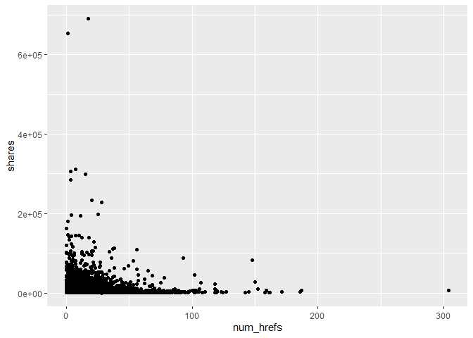
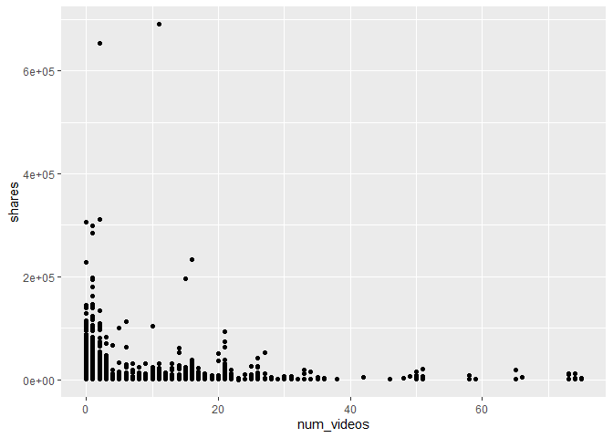
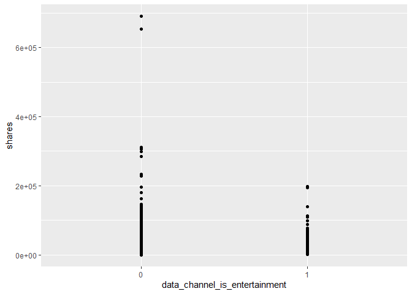
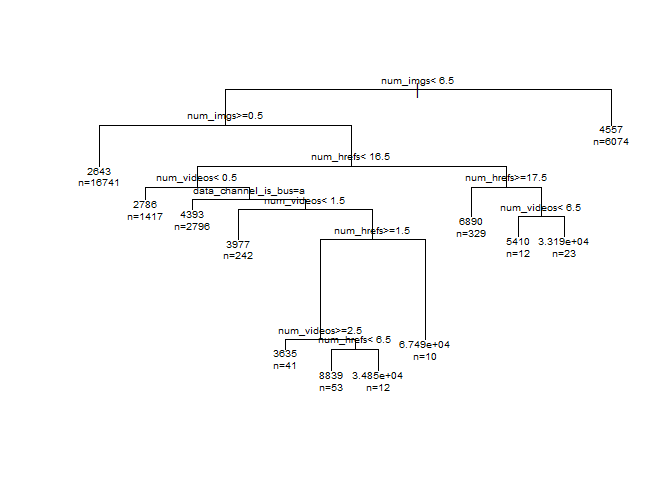

Project 2
================
Yumin Wu
October 10, 2020

``` r
library(shiny)
library(dplyr)
library(caret)
library(ggplot2)
library(purrr)
library(tidyr)
library(corrplot)
library(rpart)
library(gbm)
library(rmarkdown)
```

Introduction
------------

The data set is about the number of sharing articles on a website. There are 19 predictors in this data. Such as: Number of words in the title,Number of words in the content, Number of links, Number of links to other articles published by Mashable, Number of links to other articles published by Mashable, Number of images,Number of videos, different kinds of channels (Lifestyle,Entertainment,Business, Social Media, Tech, World...) and if the article is published on Monday, Tuesday, Wednesday, etc. The purpose of my analysis is to find which factors would lead to more shares. I would use regression tree model and boosted tree model.

``` r
#Read in and process data
OnlineNewsPopularity<-read.csv("../dataset/OnlineNewsPopularity.csv")

OnlineNewsPopularity<-OnlineNewsPopularity%>%select(n_tokens_title,n_tokens_content,num_hrefs,num_self_hrefs,num_imgs,num_videos,data_channel_is_lifestyle,data_channel_is_entertainment,data_channel_is_bus,data_channel_is_socmed,data_channel_is_tech,data_channel_is_world,weekday_is_monday,weekday_is_tuesday,weekday_is_wednesday,weekday_is_thursday,weekday_is_friday,weekday_is_saturday,weekday_is_sunday,shares)

OnlineNewsPopularity<-tbl_df(OnlineNewsPopularity)

OnlineNewsPopularity$data_channel_is_lifestyle<-as.factor(OnlineNewsPopularity$data_channel_is_lifestyle)
OnlineNewsPopularity$data_channel_is_entertainment<-as.factor(OnlineNewsPopularity$data_channel_is_entertainment)
OnlineNewsPopularity$data_channel_is_bus<-as.factor(OnlineNewsPopularity$data_channel_is_bus)
OnlineNewsPopularity$data_channel_is_socmed<-as.factor(OnlineNewsPopularity$data_channel_is_socmed)
OnlineNewsPopularity$data_channel_is_tech<-as.factor(OnlineNewsPopularity$data_channel_is_tech)
OnlineNewsPopularity$data_channel_is_world<-as.factor(OnlineNewsPopularity$data_channel_is_world)
OnlineNewsPopularity$weekday_is_monday<-as.factor(OnlineNewsPopularity$weekday_is_monday)
OnlineNewsPopularity$weekday_is_tuesday<-as.factor(OnlineNewsPopularity$weekday_is_tuesday)
OnlineNewsPopularity$weekday_is_wednesday<-as.factor(OnlineNewsPopularity$weekday_is_wednesday)
OnlineNewsPopularity$weekday_is_thursday<-as.factor(OnlineNewsPopularity$weekday_is_thursday)
OnlineNewsPopularity$weekday_is_friday<-as.factor(OnlineNewsPopularity$weekday_is_friday)
OnlineNewsPopularity$weekday_is_saturday<-as.factor(OnlineNewsPopularity$weekday_is_saturday)
OnlineNewsPopularity$weekday_is_sunday<-as.factor(OnlineNewsPopularity$weekday_is_sunday)
```

``` r
# Form training and test data
set.seed(1)
nr = nrow(OnlineNewsPopularity)
train <- sample(1:nr, size = nr*0.7)
test <- setdiff(1:nr, train)
OnlineNewsPopDataTrain <- OnlineNewsPopularity[train, ]
OnlineNewsPopDataTest <- OnlineNewsPopularity[test, ]
```

Visual plots
------------

The first plot is the correlation among the variables. The scatter plots show the relationships between the number of shares and the number of words in contents, the number of links, the number of pictures and the number of videos.

``` r
#Summarization
news_correlation <- cor(select(OnlineNewsPopDataTrain,n_tokens_title,n_tokens_content,num_hrefs, num_self_hrefs,num_imgs,num_videos,shares))
corrplot(news_correlation, type = "upper", tl.pos = "lt")
corrplot(news_correlation, type = "lower", method = "number", add = TRUE, tl.pos = "n")
```


``` r
ggplot(OnlineNewsPopDataTrain, aes(x = n_tokens_content, y = shares)) +
geom_point() 
```


``` r
ggplot(OnlineNewsPopDataTrain, aes(x = num_hrefs, y = shares)) +
geom_point() 
```



``` r
ggplot(OnlineNewsPopDataTrain, aes(x = num_videos, y = shares)) +
geom_point() 
```



``` r
ggplot(OnlineNewsPopDataTrain, aes(x = num_imgs, y = shares)) +
geom_point()
```


``` r
ggplot(OnlineNewsPopDataTrain, aes(x = data_channel_is_socmed, y = shares)) +
geom_point() 
```


``` r
ggplot(OnlineNewsPopDataTrain, aes(x = data_channel_is_socmed, y = shares)) +
geom_point() 
```


``` r
ggplot(OnlineNewsPopDataTrain, aes(x = data_channel_is_entertainment, y = shares)) +
geom_point() 
```



``` r
ggplot(OnlineNewsPopDataTrain, aes(x = data_channel_is_tech, y = shares)) +
geom_point() 
```


``` r
ggplot(OnlineNewsPopDataTrain, aes(x = data_channel_is_world, y = shares)) +
geom_point() 
```


``` r
OnlineNewsPopDataTrain %>%summarise(
          count = n(),
          mean_tokens_title = mean(n_tokens_title, na.rm = TRUE),
          mean_tokens_content = mean(n_tokens_content, na.rm = TRUE),
          mean_imgs = mean(num_imgs, na.rm = TRUE),
          mean_videos = mean(num_videos, na.rm = TRUE),
          mean_links = mean(num_hrefs, na.rm = TRUE),
          mean_other_links = mean(num_self_hrefs, na.rm = TRUE)
          )
```

    ## # A tibble: 1 x 7
    ##   count mean_tokens_title mean_tokens_content mean_imgs mean_videos mean_links mean_other_links
    ##   <int>             <dbl>               <dbl>     <dbl>       <dbl>      <dbl>            <dbl>
    ## 1 27750              10.4                546.      4.55        1.25       10.8             3.30

Model
-----

For the unensembled tree model, I checked the correlation among the variables and the scatter plots to choose the predictors. Set the different values for minsplit and cp to choose the final model.Then choose the model with the smaller RMSE.
For the second model, I used the boosted tree method to build the model, set the grid for tuning parameters and used cross validation to choose the final model.

``` r
#a (not ensemble) tree-based model
set.seed(2)
cur_d = params$days
formula = paste0("shares~num_hrefs+num_imgs+num_videos+",cur_d,"+data_channel_is_world+data_channel_is_tech+data_channel_is_socmed+data_channel_is_bus+data_channel_is_entertainment")
formula = as.formula(formula)

treeFit0<-rpart(formula, data=OnlineNewsPopDataTrain, method="anova",control=rpart.control(minsplit=20, cp=0.001) )

treeFit<-rpart(formula, data=OnlineNewsPopDataTrain, method="anova",control=rpart.control(minsplit=30, cp=0.001) )

tree0Pred<-predict(treeFit0,newdata=select(OnlineNewsPopDataTest,-shares))
tree0RMSE<-sqrt(mean((tree0Pred-OnlineNewsPopDataTest$shares)^2))

treePred<-predict(treeFit,newdata=select(OnlineNewsPopDataTest,-shares))
treeRMSE<-sqrt(mean((treePred-OnlineNewsPopDataTest$shares)^2))

tree0RMSE
```

    ## [1] 12663.68

``` r
treeRMSE
```

    ## [1] 12289.43

``` r
plot(treeFit)
text(treeFit, cex=.6,use.n = TRUE, xpd = TRUE)
```



``` r
#a boosted tree model chosen using cross-validation
cur_d = params$days
set.seed(2)

fitControl <- trainControl(
                           method = "cv",
                           number = 10)
gbmGrid <-  expand.grid(interaction.depth = c(1, 3), 
                        n.trees = 5000, 
                        shrinkage = 0.1,
                        n.minobsinnode = 20)
formula = paste0("shares~num_hrefs+num_imgs+num_videos+",cur_d,"+data_channel_is_world+data_channel_is_tech+data_channel_is_socmed+data_channel_is_bus+data_channel_is_entertainment")
formula = as.formula(formula)

gbmFit <- train(formula, data = OnlineNewsPopDataTrain, 
                 method = "gbm", 
                 preProcess = c("center", "scale"),
                 trControl = fitControl, 
                 verbose = FALSE, 
                 tuneGrid = gbmGrid)
gbmFit
```

    ## Stochastic Gradient Boosting 
    ## 
    ## 27750 samples
    ##     9 predictor
    ## 
    ## Pre-processing: centered (9), scaled (9) 
    ## Resampling: Cross-Validated (10 fold) 
    ## Summary of sample sizes: 24975, 24975, 24975, 24975, 24976, 24975, ... 
    ## Resampling results across tuning parameters:
    ## 
    ##   interaction.depth  RMSE      Rsquared     MAE     
    ##   1                  10297.75  0.014013595  3075.068
    ##   3                  10766.23  0.004707537  3280.119
    ## 
    ## Tuning parameter 'n.trees' was held constant at a value of 5000
    ## Tuning parameter 'shrinkage' was held
    ##  constant at a value of 0.1
    ## Tuning parameter 'n.minobsinnode' was held constant at a value of 20
    ## RMSE was used to select the optimal model using the smallest value.
    ## The final values used for the model were n.trees = 5000, interaction.depth = 1, shrinkage = 0.1
    ##  and n.minobsinnode = 20.

Comparison
----------

I used the test data set to predict in order to compare the RMSE between two models. The final model should be the boosted tree model. As the RMSE of it is less than that of the unensembled tree model.

``` r
#Compare two models on the test set
treePred<-predict(treeFit,newdata=select(OnlineNewsPopDataTest,-shares))
treeRMSE<-sqrt(mean((treePred-OnlineNewsPopDataTest$shares)^2))

boostPred<-predict(gbmFit,newdata=select(OnlineNewsPopDataTest,-shares),n.trees=5000)
boostRMSE<-sqrt(mean((boostPred-OnlineNewsPopDataTest$shares)^2))
c(tree=treeRMSE,boost=boostRMSE)
```

    ##     tree    boost 
    ## 12289.43 12040.82
