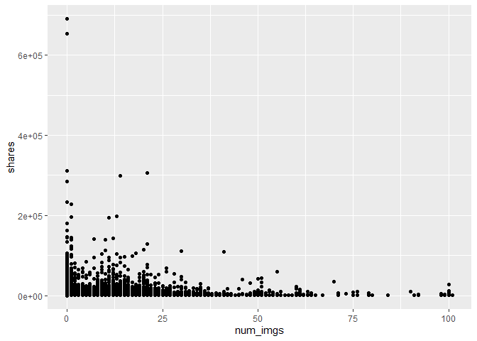
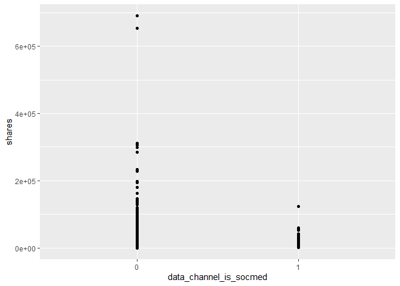
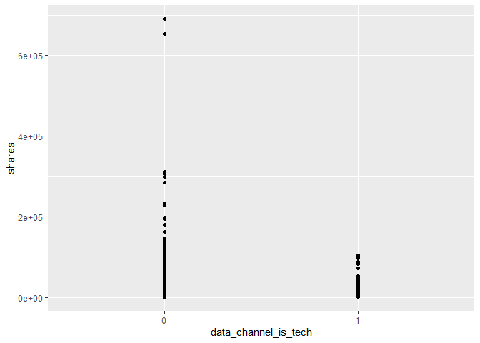

Project 2
================
Yumin Wu
October 10, 2020

``` r
library(shiny)
library(dplyr)
library(caret)
library(ggplot2)
library(purrr)
library(tidyr)
library(corrplot)
library(rpart)
library(gbm)
library(rmarkdown)
```

``` r
#Read in and process data
OnlineNewsPopularity<-read.csv("../dataset/OnlineNewsPopularity.csv")

OnlineNewsPopularity<-OnlineNewsPopularity%>%select(n_tokens_title,n_tokens_content,num_hrefs,num_self_hrefs,num_imgs,num_videos,data_channel_is_lifestyle,data_channel_is_entertainment,data_channel_is_bus,data_channel_is_socmed,data_channel_is_tech,data_channel_is_world,weekday_is_monday,weekday_is_tuesday,weekday_is_wednesday,weekday_is_thursday,weekday_is_friday,weekday_is_saturday,weekday_is_sunday,shares)

OnlineNewsPopularity<-tbl_df(OnlineNewsPopularity)

OnlineNewsPopularity$data_channel_is_lifestyle<-as.factor(OnlineNewsPopularity$data_channel_is_lifestyle)
OnlineNewsPopularity$data_channel_is_entertainment<-as.factor(OnlineNewsPopularity$data_channel_is_entertainment)
OnlineNewsPopularity$data_channel_is_bus<-as.factor(OnlineNewsPopularity$data_channel_is_bus)
OnlineNewsPopularity$data_channel_is_socmed<-as.factor(OnlineNewsPopularity$data_channel_is_socmed)
OnlineNewsPopularity$data_channel_is_tech<-as.factor(OnlineNewsPopularity$data_channel_is_tech)
OnlineNewsPopularity$data_channel_is_world<-as.factor(OnlineNewsPopularity$data_channel_is_world)
OnlineNewsPopularity$weekday_is_monday<-as.factor(OnlineNewsPopularity$weekday_is_monday)
OnlineNewsPopularity$weekday_is_tuesday<-as.factor(OnlineNewsPopularity$weekday_is_tuesday)
OnlineNewsPopularity$weekday_is_wednesday<-as.factor(OnlineNewsPopularity$weekday_is_wednesday)
OnlineNewsPopularity$weekday_is_thursday<-as.factor(OnlineNewsPopularity$weekday_is_thursday)
OnlineNewsPopularity$weekday_is_friday<-as.factor(OnlineNewsPopularity$weekday_is_friday)
OnlineNewsPopularity$weekday_is_saturday<-as.factor(OnlineNewsPopularity$weekday_is_saturday)
OnlineNewsPopularity$weekday_is_sunday<-as.factor(OnlineNewsPopularity$weekday_is_sunday)
```

``` r
# Form training and test data
set.seed(1)
nr = nrow(OnlineNewsPopularity)
train <- sample(1:nr, size = nr*0.7)
test <- setdiff(1:nr, train)
OnlineNewsPopDataTrain <- OnlineNewsPopularity[train, ]
OnlineNewsPopDataTest <- OnlineNewsPopularity[test, ]
```

``` r
#Summarization
news_correlation <- cor(select(OnlineNewsPopDataTrain,n_tokens_title,n_tokens_content,num_hrefs, num_self_hrefs,num_imgs,num_videos,shares))
corrplot(news_correlation, type = "upper", tl.pos = "lt")
corrplot(news_correlation, type = "lower", method = "number", add = TRUE, tl.pos = "n")
```


``` r
ggplot(OnlineNewsPopDataTrain, aes(x = n_tokens_content, y = shares)) +
geom_point() 
```


``` r
ggplot(OnlineNewsPopDataTrain, aes(x = num_hrefs, y = shares)) +
geom_point() 
```


``` r
ggplot(OnlineNewsPopDataTrain, aes(x = num_videos, y = shares)) +
geom_point() 
```


``` r
ggplot(OnlineNewsPopDataTrain, aes(x = num_imgs, y = shares)) +
geom_point()
```



``` r
ggplot(OnlineNewsPopDataTrain, aes(x = data_channel_is_socmed, y = shares)) +
geom_point() 
```


``` r
ggplot(OnlineNewsPopDataTrain, aes(x = data_channel_is_socmed, y = shares)) +
geom_point() 
```



``` r
ggplot(OnlineNewsPopDataTrain, aes(x = data_channel_is_entertainment, y = shares)) +
geom_point() 
```


``` r
ggplot(OnlineNewsPopDataTrain, aes(x = data_channel_is_tech, y = shares)) +
geom_point() 
```



``` r
ggplot(OnlineNewsPopDataTrain, aes(x = data_channel_is_world, y = shares)) +
geom_point() 
```


``` r
OnlineNewsPopDataTrain %>%summarise(
          count = n(),
          mean_tokens_title = mean(n_tokens_title, na.rm = TRUE),
          mean_tokens_content = mean(n_tokens_content, na.rm = TRUE),
          mean_imgs = mean(num_imgs, na.rm = TRUE),
          mean_videos = mean(num_videos, na.rm = TRUE),
          mean_links = mean(num_hrefs, na.rm = TRUE),
          mean_other_links = mean(num_self_hrefs, na.rm = TRUE)
          )
```

    ## # A tibble: 1 x 7
    ##   count mean_tokens_tit~ mean_tokens_con~ mean_imgs mean_videos mean_links
    ##   <int>            <dbl>            <dbl>     <dbl>       <dbl>      <dbl>
    ## 1 27750             10.4             546.      4.55        1.25       10.8
    ## # ... with 1 more variable: mean_other_links <dbl>

``` r
#a (not ensemble) tree-based model
set.seed(2)
cur_d = params$days
formula = paste0("shares~num_hrefs+num_imgs+num_videos+",cur_d,"+data_channel_is_world+data_channel_is_tech+data_channel_is_socmed+data_channel_is_bus+data_channel_is_entertainment")
formula = as.formula(formula)

treeFit<-rpart(formula, data=OnlineNewsPopDataTrain, method="anova",control=rpart.control(minsplit=20, cp=0.001) )

treeFit
```

    ## n= 27750 
    ## 
    ## node), split, n, deviance, yval
    ##       * denotes terminal node
    ## 
    ##   1) root 27750 3.618011e+12   3352.303  
    ##     2) num_imgs< 7.5 21989 1.977477e+12   2980.438  
    ##       4) num_imgs>=0.5 17116 9.088367e+11   2616.567  
    ##         8) num_hrefs< 26.5 16355 3.892224e+11   2516.535 *
    ##         9) num_hrefs>=26.5 761 5.159334e+11   4766.410  
    ##          18) num_hrefs>=27.5 690 7.642031e+10   3925.064 *
    ##          19) num_hrefs< 27.5 71 4.342780e+11  12942.870  
    ##            38) data_channel_is_tech=0 62 4.858188e+09   3736.194 *
    ##            39) data_channel_is_tech=1 9 3.879613e+11  76366.670 *
    ##       5) num_imgs< 0.5 4873 1.058414e+12   4258.503  
    ##        10) num_hrefs< 16.5 4542 5.234512e+11   3963.135 *
    ##        11) num_hrefs>=16.5 331 5.291295e+11   8311.553  
    ##          22) num_hrefs>=17.5 299 6.155981e+10   6567.395 *
    ##          23) num_hrefs< 17.5 32 4.581611e+11  24608.530  
    ##            46) weekday_is_monday=0 25 5.228951e+08   2878.920 *
    ##            47) weekday_is_monday=1 7 4.036753e+11 102214.300 *
    ##     3) num_imgs>=7.5 5761 1.625888e+12   4771.663  
    ##       6) num_hrefs< 14.5 2714 2.843431e+11   3894.179 *
    ##       7) num_hrefs>=14.5 3047 1.337593e+12   5553.248  
    ##        14) num_videos< 0.5 1972 2.333413e+11   4929.809 *
    ##        15) num_videos>=0.5 1075 1.102080e+12   6696.897  
    ##          30) data_channel_is_bus=0 1037 1.015216e+12   6444.658  
    ##            60) num_hrefs< 23.5 557 5.434299e+10   4965.088 *
    ##            61) num_hrefs>=23.5 480 9.582386e+11   8161.575  
    ##             122) num_hrefs>=28.5 312 5.238141e+10   5524.035 *
    ##             123) num_hrefs< 28.5 168 8.996558e+11  13059.860  
    ##               246) num_hrefs< 27.5 143 2.053140e+11   8905.860  
    ##                 492) num_imgs< 17.5 89 2.791157e+09   4051.438 *
    ##                 493) num_imgs>=17.5 54 1.969688e+11  16906.670  
    ##                   986) num_imgs>=19.5 47 1.272998e+10   8831.021 *
    ##                   987) num_imgs< 19.5 7 1.605934e+11  71128.860 *
    ##               247) num_hrefs>=27.5 25 6.777598e+11  36820.760  
    ##                 494) num_imgs>=15.5 16 2.012490e+08   2991.812 *
    ##                 495) num_imgs< 15.5 9 6.266964e+11  96961.110 *
    ##          31) data_channel_is_bus=1 38 8.499730e+10  13580.370  
    ##            62) num_hrefs>=18.5 30 1.436980e+09   6088.467 *
    ##            63) num_hrefs< 18.5 8 7.556200e+10  41675.000 *

``` r
plot(treeFit)
text(treeFit, cex=.6,use.n = TRUE, xpd = TRUE)
```


``` r
#a boosted tree model chosen using cross-validation
cur_d = params$days
set.seed(2)

fitControl <- trainControl(
                           method = "cv",
                           number = 10)
gbmGrid <-  expand.grid(interaction.depth = c(1, 3), 
                        n.trees = 5000, 
                        shrinkage = 0.1,
                        n.minobsinnode = 20)
formula = paste0("shares~num_hrefs+num_imgs+num_videos+",cur_d,"+data_channel_is_world+data_channel_is_tech+data_channel_is_socmed+data_channel_is_bus+data_channel_is_entertainment")
formula = as.formula(formula)

gbmFit <- train(formula, data = OnlineNewsPopDataTrain, 
                 method = "gbm", 
                 preProcess = c("center", "scale"),
                 trControl = fitControl, 
                 verbose = FALSE, 
                 tuneGrid = gbmGrid)
gbmFit
```

    ## Stochastic Gradient Boosting 
    ## 
    ## 27750 samples
    ##     9 predictor
    ## 
    ## Pre-processing: centered (9), scaled (9) 
    ## Resampling: Cross-Validated (10 fold) 
    ## Summary of sample sizes: 24975, 24975, 24975, 24975, 24976, 24975, ... 
    ## Resampling results across tuning parameters:
    ## 
    ##   interaction.depth  RMSE      Rsquared     MAE     
    ##   1                  10297.45  0.014030802  3078.025
    ##   3                  10859.77  0.004235065  3324.532
    ## 
    ## Tuning parameter 'n.trees' was held constant at a value of 5000
    ## 
    ## Tuning parameter 'shrinkage' was held constant at a value of 0.1
    ## 
    ## Tuning parameter 'n.minobsinnode' was held constant at a value of 20
    ## RMSE was used to select the optimal model using the smallest value.
    ## The final values used for the model were n.trees = 5000, interaction.depth =
    ##  1, shrinkage = 0.1 and n.minobsinnode = 20.

``` r
#Compare two models on the test set
treePred<-predict(treeFit,newdata=select(OnlineNewsPopDataTest,-shares))
treeRMSE<-sqrt(mean((treePred-OnlineNewsPopDataTest$shares)^2))

boostPred<-predict(gbmFit,newdata=select(OnlineNewsPopDataTest,-shares),n.trees=5000)
boostRMSE<-sqrt(mean((boostPred-OnlineNewsPopDataTest$shares)^2))
c(tree=treeRMSE,boost=boostRMSE)
```

    ##     tree    boost 
    ## 12637.70 12041.13
